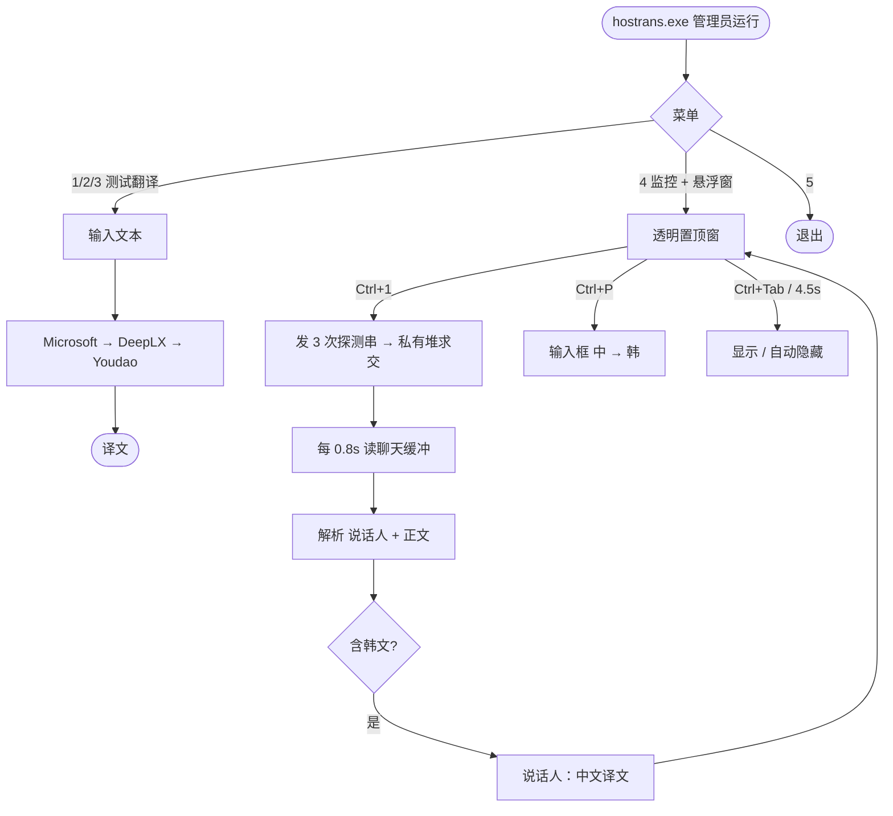

# HOSTrans

风暴英雄韩服聊天翻译 · **无 Key · 开箱即用 · 单文件**



Windows：[Releases](https://github.com/lewoking/hostrans-go/releases/latest) 下载后 **管理员运行**。游戏请用**窗口化最大化**，进对局后按 **Ctrl+1** 初始化。

```bash
GOOS=windows GOARCH=amd64 CGO_ENABLED=0 go build -ldflags="-s -w" -o hostrans.exe .
```
