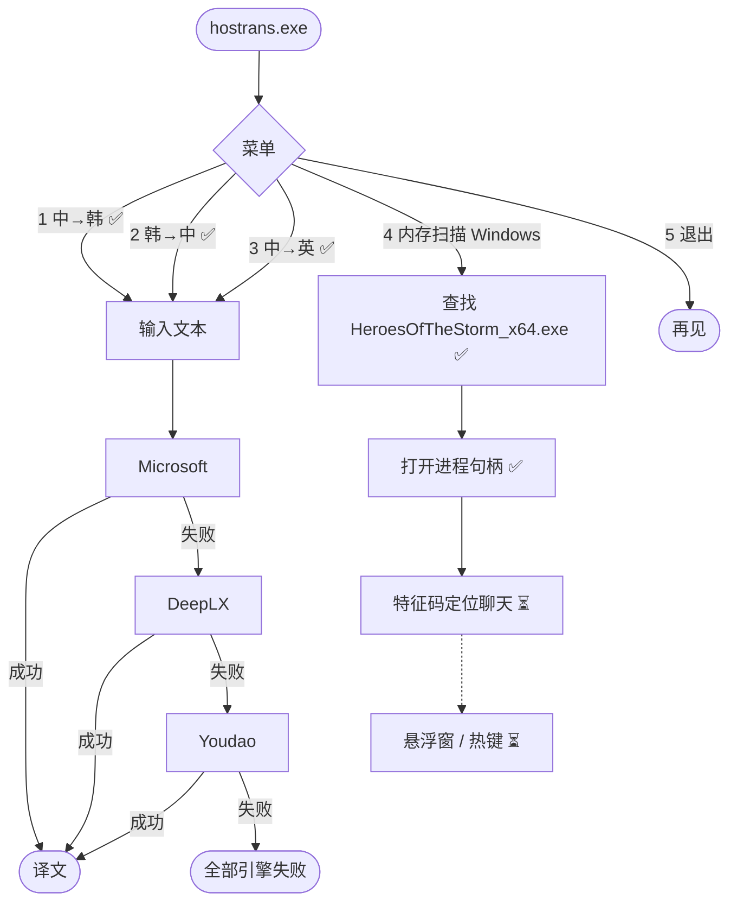

# HOSTrans

风暴英雄韩服聊天翻译 · **无 Key · 开箱即用 · 单文件**


```mermaid
flowchart TB
    Start(["hostrans.exe"]) --> Menu{菜单}

    Menu -->|"1 中→韩 ✅"| In[输入文本]
    Menu -->|"2 韩→中 ✅"| In
    Menu -->|"3 中→英 ✅"| In
    Menu -->|"4 内存扫描 Windows"| Find
    Menu -->|"5 退出"| End([再见])

    In --> MS[Microsoft]
    MS -->|成功| Out([译文])
    MS -->|失败| DX[DeepLX]
    DX -->|成功| Out
    DX -->|失败| YD[Youdao]
    YD -->|成功| Out
    YD -->|失败| Fail([全部引擎失败])

    Find[查找 HeroesOfTheStorm_x64.exe ✅] --> Open[打开进程句柄 ✅]
    Open --> Chat[特征码定位聊天 ⏳]
    Chat -.-> Overlay[悬浮窗 / 热键 ⏳]
```

Windows 运行：双击 `hostrans.exe`。macOS / Linux 交叉编译：

```bash
GOOS=windows GOARCH=amd64 CGO_ENABLED=0 go build -ldflags="-s -w" -o hostrans.exe .
```
