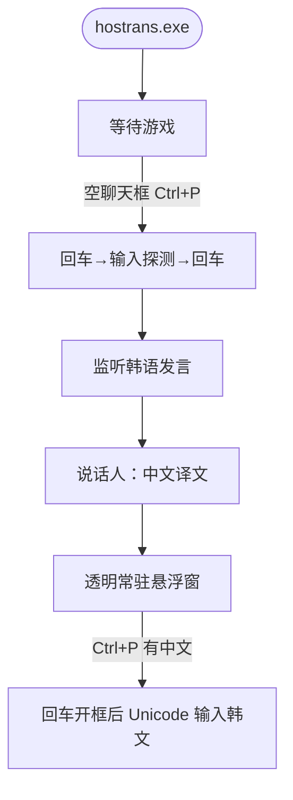

# HOSTrans

风暴英雄韩服聊天翻译 · **无 Key · 开箱即用 · 单文件**



Windows：[Releases](https://github.com/lewoking/hostrans-go/releases/latest) 管理员运行，窗口化最大化。

- 悬浮窗常驻、背景全透明
- Ctrl+P：有中文 → 中译韩；空框 → 初始化（回车、打字、回车，不用 Ctrl+V）
- 翻译：Google → DeepLX

```bash
GOOS=windows GOARCH=amd64 CGO_ENABLED=0 go build -ldflags="-s -w -H windowsgui" -o hostrans.exe .
```
