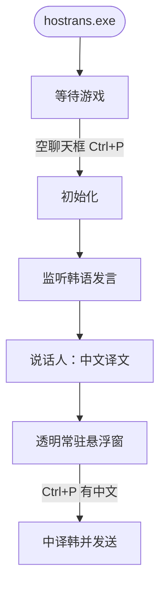

# HOSTrans

风暴英雄韩服聊天翻译 · **无 Key · 开箱即用 · 单文件**



Windows：[Releases](https://github.com/lewoking/hostrans-go/releases/latest) 管理员运行，窗口化最大化。

- 空聊天框 Ctrl+P：初始化
- 有中文时 Ctrl+P：中译韩
- 悬浮窗显示韩语发言的中文译文

```bash
GOOS=windows GOARCH=amd64 CGO_ENABLED=0 go build -ldflags="-s -w -H windowsgui" -o hostrans.exe .
```
