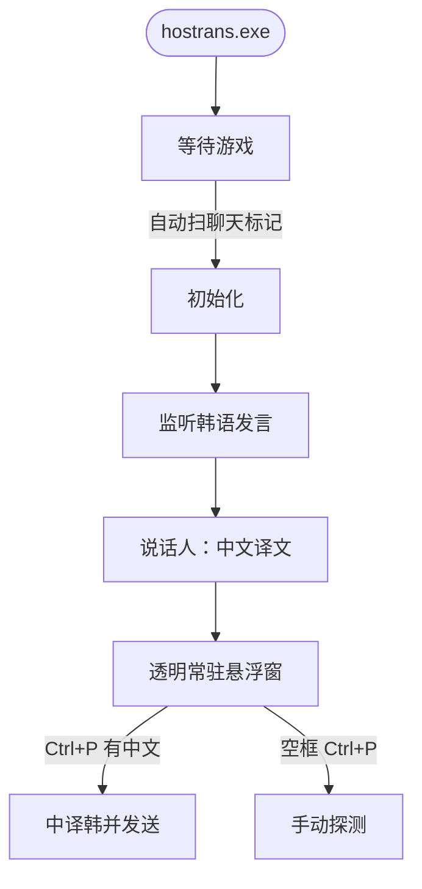

# HOSTrans

风暴英雄韩服聊天翻译 · **开箱即用 · 单文件**

Windows：[Releases](https://github.com/lewoking/hostrans-go/releases/latest) 管理员运行，窗口化最大化。

- 进游戏后自动探测聊天缓冲（不往队频发字）
- 自动没找到：空聊天框 Ctrl+P 手动初始化
- 有中文时 Ctrl+P：中译韩
- 悬浮窗显示韩语发言的中文译文
- 30 秒无新译文后字体缩为 1/5，新句或显示窗口时恢复

