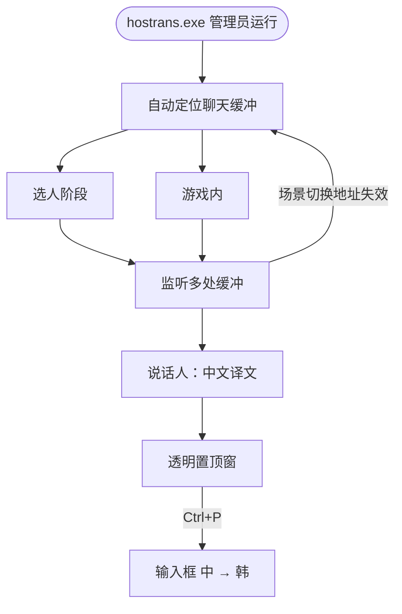

# HOSTrans

风暴英雄韩服聊天翻译 · **无 Key · 开箱即用 · 单文件**



Windows：[Releases](https://github.com/lewoking/hostrans-go/releases/latest) 双击后会要管理员。窗口化最大化。选人/局内自动跟。Ctrl+P 中译韩。

```bash
GOOS=windows GOARCH=amd64 CGO_ENABLED=0 go build -ldflags="-s -w -H windowsgui" -o hostrans.exe .
```
